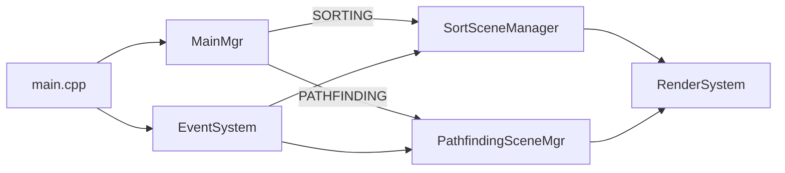
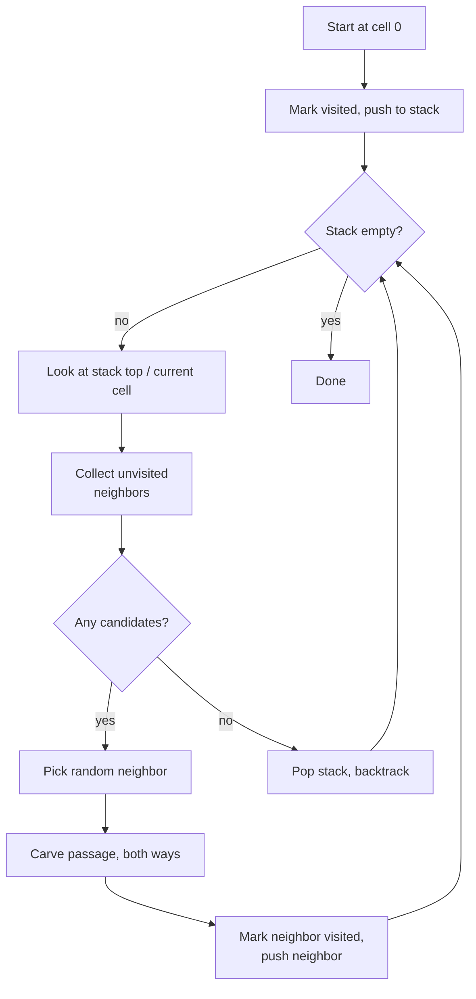
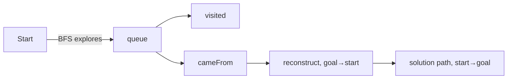
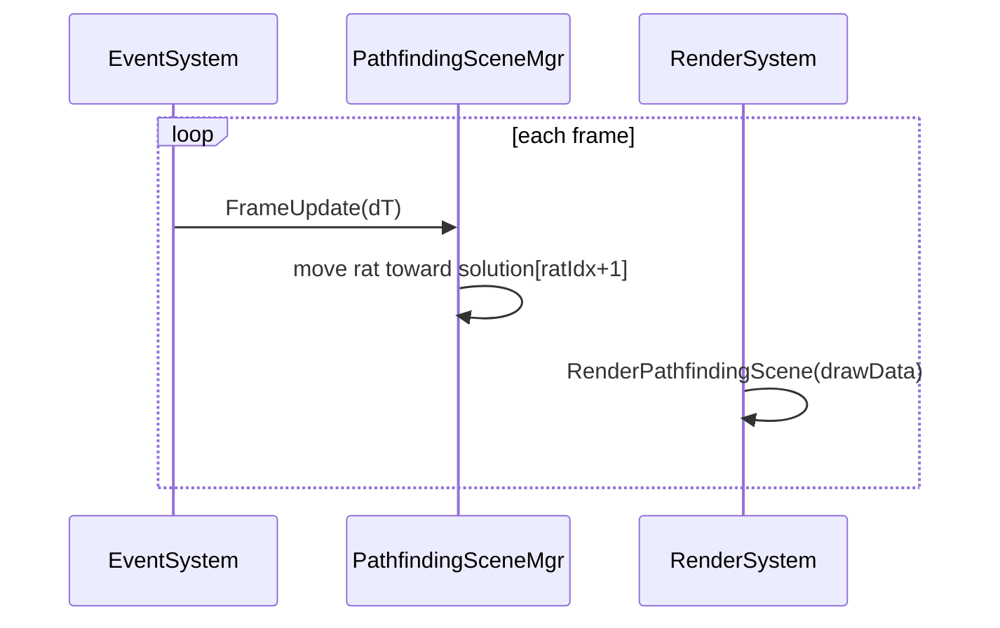

# Pathfinding Visualization (VG)

This document describes the **pathfinding visualization** portion of this assignment (“Algorithms and Data Structures”).

- **Goal:** generate a random maze, compute a shortest path from **start** to **goal**, and visualize an agent (“rat”) moving along that path.
- **Implementation focus:** representing the maze as a graph + using a graph traversal algorithm (BFS) to produce a path.

## How to run / where to look

- Pathfinding scene manager (entry point for this part): `Pathfinding/PathfindingSceneMgr.h`
- Maze generation + maze→graph conversion: `Pathfinding/MazeTools.h`
- Rendering of the maze and agent: `RenderSystem/RenderSystem.h`
- Shared draw-data structs: `Data/structs.h`

Project-wide entry point, mode switching, and controls are summarized in **[README.md](./README.md)**.

## High-level architecture

The program has two modes (sorting + pathfinding). The active mode decides which “scene manager” produces draw data and which render path is used.

### Mode switching

In `main.cpp`, both scene managers are constructed and initialized. When pressing the mode-switch keys, the code:

- deactivates the previous scene
- reinitializes the newly selected scene
- switches `MainMgr::currentVizMode`

(See `OnSortingPressed(...)` and `OnPathfindingPressed(...)` in `main.cpp`.)

## Pathfinding scene: responsibilities

`PathfindingSceneMgr` owns the state needed to generate, solve, and animate a maze:

- **Maze parameters**: grid size, node spacing, screen offsets
- **Draw state** (stored in `PathfindingSceneDrawData`):
  - `graph` (maze represented as adjacency lists)
  - `nodePosDict` (node id → on-screen position)
  - `solution` (list of node ids forming the path)
  - agent position (`ratPosX`, `ratPosY`)
- **Runtime state**:
  - `ratIdx` (which segment of the solution path the rat is currently moving along)
  - `ratAtGoal`

It subscribes to the global `EventSystem` in its constructor:

- `FrameUpdate` → `OnFrameUpdate(dT)`
- `ResetPressed` → `OnResetPressed()`

(There are also placeholders for increasing/decreasing speed and stepping, but they are currently empty.)

## Maze data model

### Grid and cell representation (`SquareMazeData`)

In `Pathfinding/MazeTools.h`, a square maze is represented as a `mazeSize x mazeSize` grid. Each cell stores a **4-bit mask** telling which cardinal directions are open:

- `NORTH` = `1000`
- `SOUTH` = `0100`
- `EAST`  = `0010`
- `WEST`  = `0001`

This makes it cheap to:

- test if movement is allowed in a direction (`HasOpen`)
- open/close corridors (`SetOpen`)

### Graph representation (adjacency list)

For pathfinding, the maze is converted to an unweighted directed graph:

- **Node id:** `MazeNodeId` (`size_t`), where `id = row * mazeSize + col`
- **Graph:** `MazeGraph = unordered_map<MazeNodeId, vector<MazeNodeId>>`

`SquareMaze::AsGraph()` creates:

- `start = 0` (top-left)
- `goal = n-1` (bottom-right)
- `graph[id] = [neighborId0, neighborId1, ...]` for each open corridor

## Maze generation algorithm

Maze generation happens inside `SquareMaze::SquareMaze(size_t mazeSize)` in `MazeTools.h`.

Approach used:

- A **randomized depth-first traversal** using a `stack` and a `visited` array.
- Start at cell `0`.
- Repeatedly:
  1. create a list of unvisited neighbor candidates
  2. pick one candidate uniformly at random
  3. *carve* a passage between current and chosen neighbor (open direction bits in both cells)
  4. push neighbor onto the stack
  5. if no candidates exist, backtrack (pop stack)

This produces a connected maze with no isolated regions (there is always at least one path between start and goal).

## Shortest path algorithm (BFS)

The shortest path is computed in `PathfindingSceneMgr::GetShortestPath()`.

- **Algorithm:** Breadth-First Search (BFS)
- **Reason:** the maze graph is **unweighted**, so BFS guarantees the path with the **fewest edges**.

Implementation details:

- `queue<MazeNodeId> q` for BFS frontier
- `visited[node]` to avoid revisiting nodes
- `cameFrom[node] = previousNode` to reconstruct the final path

When `goal` is reached, the code reconstructs the path by walking backwards:

- start from `goal`
- follow `cameFrom` until reaching `start`
- reverse the resulting list → `solution`

The returned `solution` is a `vector<MazeNodeId>` where consecutive entries are adjacent nodes to traverse.

## Visualization / rendering

Rendering uses `RenderSystem::RenderPathfindingScene(const PathfindingSceneDrawData&)`.

### Maze drawing (`DrawMaze`)

- Iterates over `nodeCount = mazeSize * mazeSize` nodes.
- Draws thick gray lines between each node and its neighbors from `graph`.
- Uses a small `visited` list to avoid drawing each undirected corridor twice.
- Draws start and goal nodes as green circles.

### Solution and agent drawing (`DrawMazeSolution`)

- The code contains an optional red line renderer for the path (currently commented out).
- The agent (“rat”) is drawn as a gold circle at (`ratPosX`, `ratPosY`).

## Agent movement / animation

`PathfindingSceneMgr::OnFrameUpdate(dT)` moves the rat towards the next node in the `solution`.

- `ratCurr = solution[ratIdx]`
- `ratNext = solution[ratIdx + 1]`
- Compute direction: `normalize(nextPos - ratPos)`
- Move: `ratPos += direction * dT * RAT_SPEED`
- When sufficiently close to the next node (`distance^2 <= CLOSE_ENOUGH`):
  - advance to the next segment (`ratIdx++`)
  - if `ratNext == goal`, set `ratAtGoal = true`

This produces smooth movement along the discrete BFS path.

## Controls (pathfinding mode)

From `RenderSystem` UI string (`pfModeControlsStr`):

- `R` : reset (re-generate maze + recompute solution)
- `S` : switch back to sorting mode
- `ESC` : quit

## Notes / limitations (current state)

- `OnIncreaseSpeedPressed`, `OnDecreaseSpeedPressed`, and `OnNextPressed` exist but are currently placeholders.
- `goalTextPosX/goalTextPosY` exist in `PathfindingSceneDrawData` but are not filled/used.
- The “draw solution path in red” feature is present but commented out in `RenderSystem::DrawMazeSolution`.

## What to evaluate in code

If you are reviewing this for the algorithm/data-structures portion, the key parts are:

- Maze generation with explicit neighbor selection + backtracking: `SquareMaze::SquareMaze` (`Pathfinding/MazeTools.h`)
- Graph representation via adjacency list: `SquareMaze::AsGraph`
- BFS shortest path + path reconstruction: `PathfindingSceneMgr::GetShortestPath` (`Pathfinding/PathfindingSceneMgr.h`)
- Visualization pipeline: `PathfindingSceneMgr` → `PathfindingSceneDrawData` → `RenderSystem`
