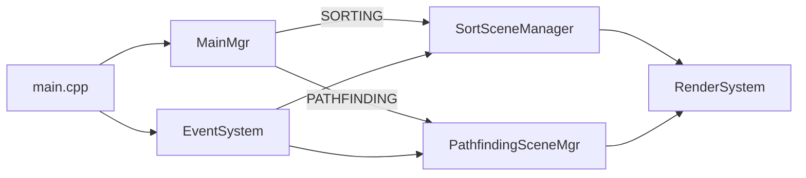
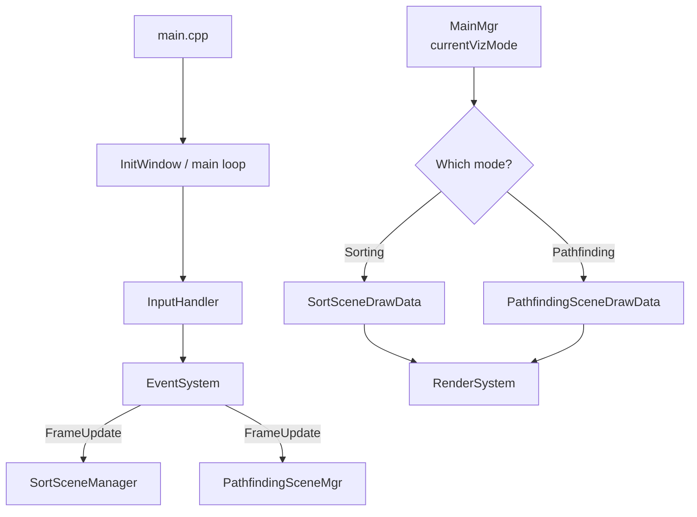

# Algorithms and Data Structures — Visualizations (Raylib + C++)

This project is a school assignment for the course unit **“Algorithms and Data Structures.”**

It contains two interactive visualizations:

1. **Sorting algorithm visualization**
2. **Pathfinding visualization**

## Documentation

- Sorting: **[SORTING_DOCUMENTATION.md](./SORTING_DOCUMENTATION.md)**
- Pathfinding: **[PATHFINDING_DOCUMENTATION.md](./PATHFINDING_DOCUMENTATION.md)**

## How to navigate the code

- Entry point / main loop: `main.cpp`
- Shared systems:
  - Input → events: `Tools/InputHandler.h`, `Tools/EventSystem.h`
  - Mode switching: `Tools/MainMgr.h`
  - Rendering: `RenderSystem/RenderSystem.h`
- Sorting:
  - Scene manager: `Sorting/SortSceneManager.h`
  - Algorithms: `Sorting/*SortScene.h`
- Pathfinding:
  - Scene manager: `Pathfinding/PathfindingSceneMgr.h`
  - Maze generation + maze→graph conversion: `Pathfinding/MazeTools.h`

## High-level runtime flow

Both visualizations share the same update/render loop:

- `main.cpp` initializes systems and both scene managers.
- Each frame:
  - `EventSystem::FrameUpdate` is invoked with `dT`.
  - The active scene manager (sorting or pathfinding) updates its internal state.
  - `RenderSystem` draws based on `MainMgr::currentVizMode`.

### Mode switching

In `main.cpp`, both scene managers are constructed and initialized. When pressing the mode-switch keys, the code:

- deactivates the previous scene
- reinitializes the newly selected scene
- switches `MainMgr::currentVizMode`

(See `OnSortingPressed(...)` and `OnPathfindingPressed(...)` in `main.cpp`.)

## Controls (global)

Controls are read in `Tools/InputHandler.h` and forwarded as events via `Tools/EventSystem.h`.

- `ESC`: quit
- `S`: switch to sorting mode
- `P`: switch to pathfinding mode
- `R`: reset current visualization (scene-specific)

Sorting-only:

- `Up Arrow`: faster (decrease step interval)
- `Down Arrow`: slower (increase step interval)
- `N`: next sorting algorithm
