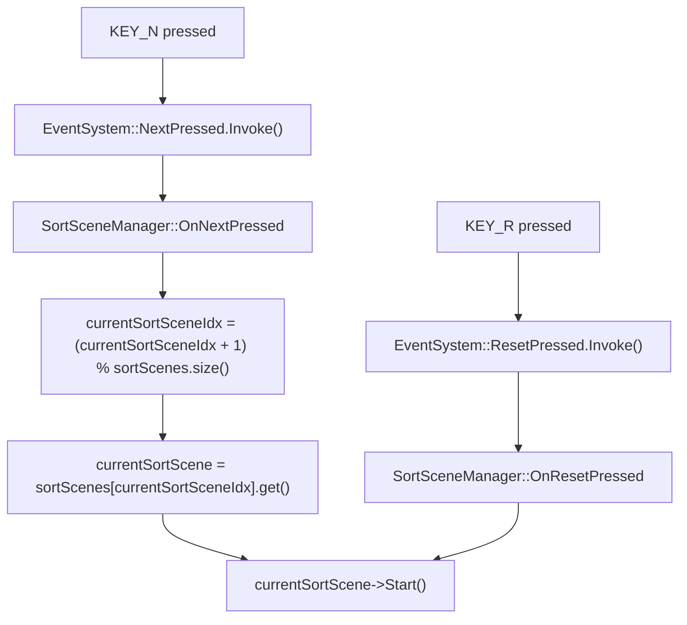
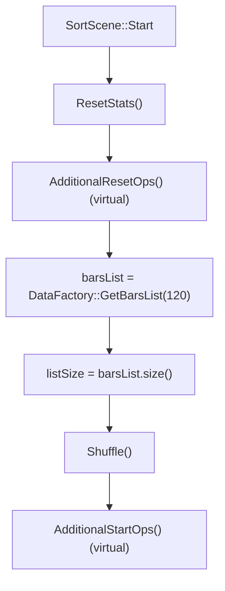
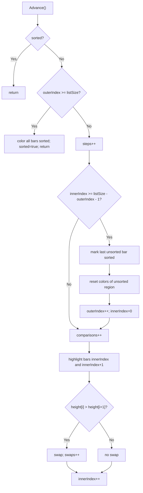
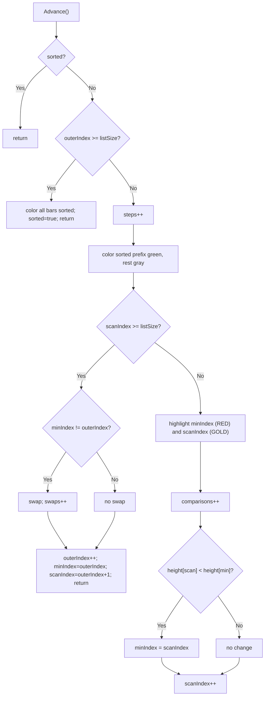
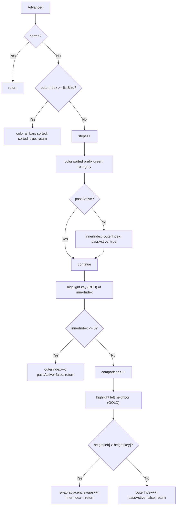
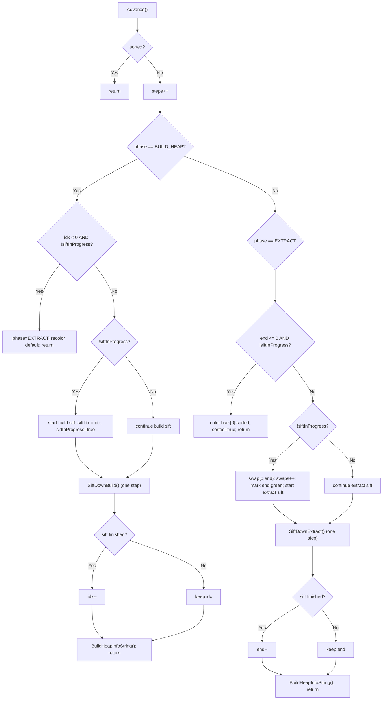
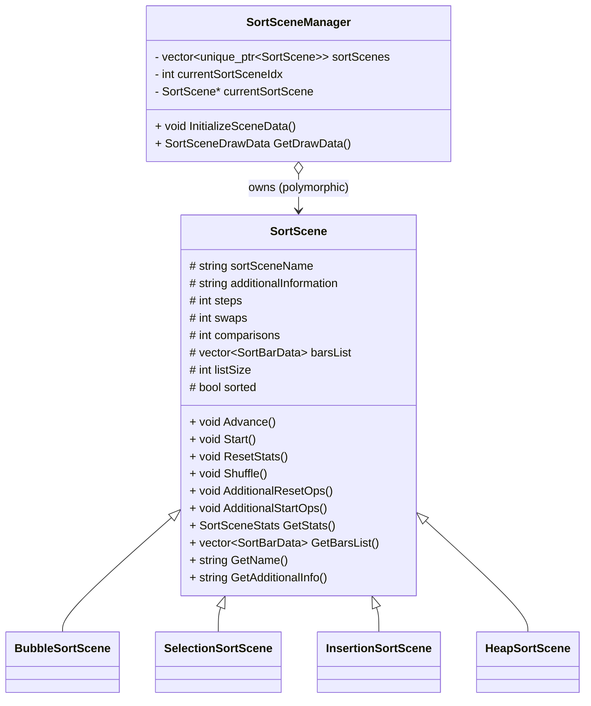

# Sorting Visualizer (Raylib + C++) — Documentation

This project visualizes sorting algorithms as animated bar charts using Raylib. Each algorithm runs incrementally: every call to `Advance()` performs a small piece of work so you can see comparisons, swaps, and sorted regions evolve over time.

Implemented sorting scenes:
- Bubble sort (`Sorting/BubbleSortScene.h`)
- Selection sort (`Sorting/SelectionSortScene.h`)
- Insertion sort (`Sorting/InsertionSortScene.h`)
- Heap sort (`Sorting/HeapSortScene.h`) — incremental heapify + extract

---

## Grading rubric checklist

- [x] Sorting visualizer similar to planning-session example
- [x] At least 3 sorting algorithms from course material
  - Implemented: Bubble, Selection, Insertion, Heap
- [x] Swap between the scenes with a button press
  - `N` cycles to the next sorting scene
- [x] Bonus: comparisons and swaps shown when the algorithm runs / completes
  - UI shows `comparisons` and `swaps`
  - Heap sort also shows build vs extract comparisons via `additionalInformation`

---

## Controls (sorting mode)

From `Tools/InputHandler.h`:

- `Up Arrow`: decrease step time (faster)
- `Down Arrow`: increase step time (slower)
- `R`: reset current algorithm (regenerate + shuffle + restart)
- `N`: next sorting algorithm
- `ESC`: quit (close Raylib window)

---

## Key design: incremental sorting with `Advance()`

All algorithms are implemented for visualization, not for fastest execution.

- Each sort scene derives from `SortScene` and overrides `Advance()`.
- The manager calls `Advance()` at a fixed interval (`stepInterval`).
- Each `Advance()` performs a small, repeatable unit of work.

### About `steps`

`steps` increments once per `Advance()` call.

That means **`steps` equals “visualization ticks”**, not a fixed algorithm-theory step count. `comparisons` and `swaps` are the more comparable metrics across algorithms.

---

## High-level architecture

- `Sorting/SortScene.h`
  - Base class for all algorithms
  - Holds stats (`steps`, `comparisons`, `swaps`), `barsList`, and `sorted`
  - Provides `Start()` + virtual hooks:
    - `AdditionalResetOps()`
    - `AdditionalStartOps()`

- `Sorting/SortSceneManager.h`
  - Owns scenes via `std::vector<std::unique_ptr<SortScene>>`
  - Tracks current scene via `currentSortSceneIdx`
  - Handles input events (Next, Reset, Speed)
  - Produces `SortSceneDrawData` for the renderer

- `RenderSystem/RenderSystem.h`
  - Draws UI + bars using `SortSceneDrawData`

- `Data/DataFactory.h`
  - Generates the bars list

---

## Program flow (update + render)

```mermaid
flowchart TD
    A["main.cpp"] --> B["InitWindow + SetTargetFPS"]
    B --> C["Create SortSceneManager"]
    C --> D["SortSceneManager::InitializeSceneData"]
    D --> E["currentSortScene->Start()"][" "]
    E --> F{"Main loop"}
    F --> G["EventSystem::FrameUpdate.Invoke(dT)"]
    G --> H["SortSceneManager::OnFrameUpdate(dT)"]
    H --> I{"tA >= stepInterval?"}
    I -->|No| F
    I -->|Yes| J["SortSceneManager::UpdateDrawData"]
    J --> K["currentSortScene->Advance()"]
    J --> L["Copy stats + barsList + additionalInfo into SortSceneDrawData"]
    F --> M["RenderSystem::RenderSortScene(drawData)"]
    M --> F
```

---

## Input/event flow (Next + Reset)



---

## `SortScene::Start()` lifecycle



---

## Metrics

- `comparisons`: increments when bar heights are compared
- `swaps`: increments when `std::swap` is called on bars
- `steps`: increments once per tick (`Advance()` call)

Note: Heap sort can do up to **two height comparisons per tick** (left child and right child), so `comparisons` can be larger than `steps`.

---

## Algorithm flow diagrams (per `Advance()`)

### Bubble sort



### Selection sort



### Insertion sort



### Heap sort (two phases)

Heap sort uses persistent state so `sift-down` can be incremental across ticks:
- `siftInProgress`
- `siftIdx`
- `siftTargetEnd`



---

## Class relationships


